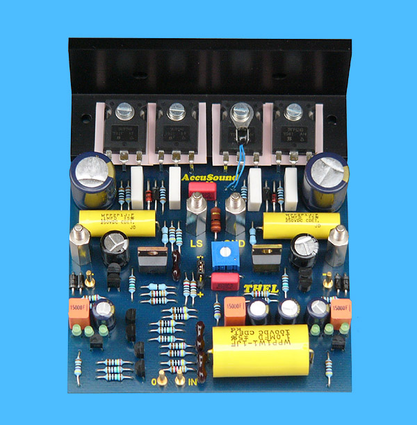

# Thel-AccuSound-40
Thel AccuSound 40 audio power amplifier (20 up to 250 Watts)  
(the 'little sibling' of the <a href="https://github.com/analoghifi/Thel-AccuSound-100">AccuSound 100</a>)
  
https://web.archive.org/web/20071014080049/http://thel-audioworld.de/MODULE/ACUSO/acsnd40.htm  
https://web.archive.org/web/20120130122554/http://thel-audioworld.de/module/acuso/acsnd40.htm  
  

